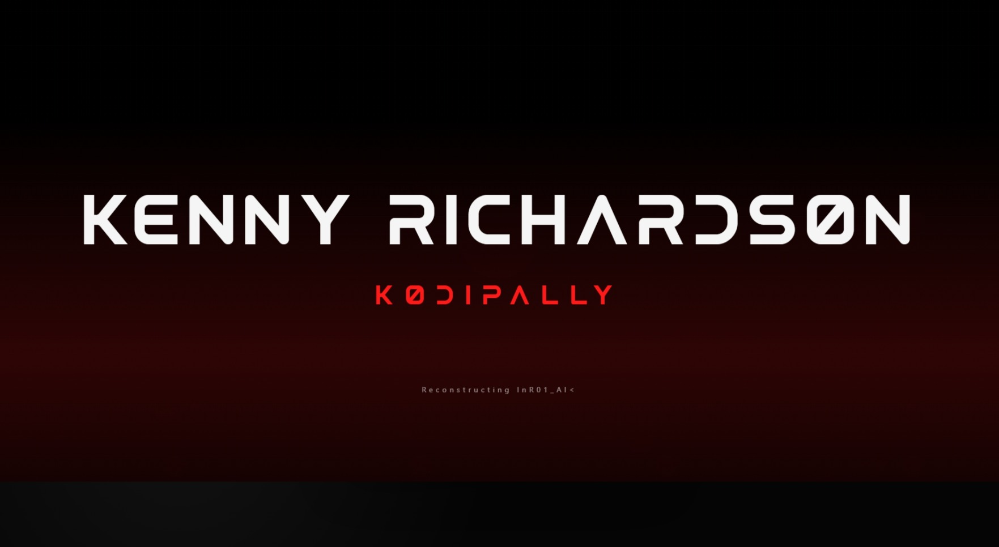
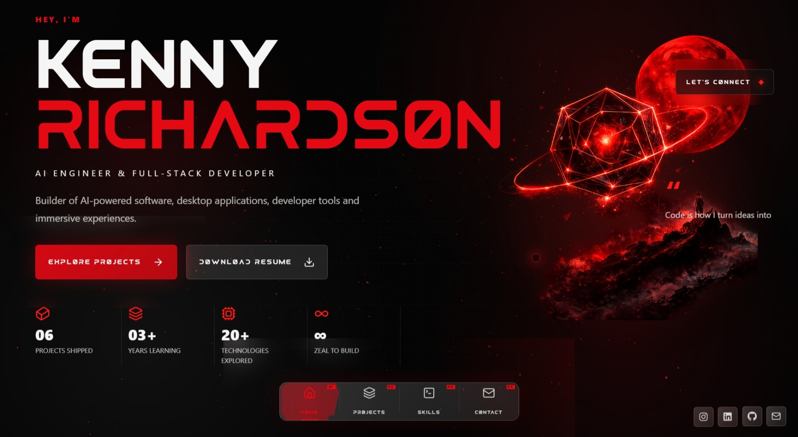
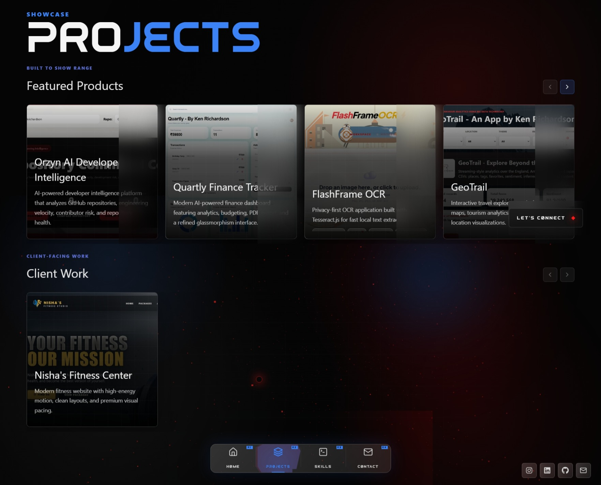
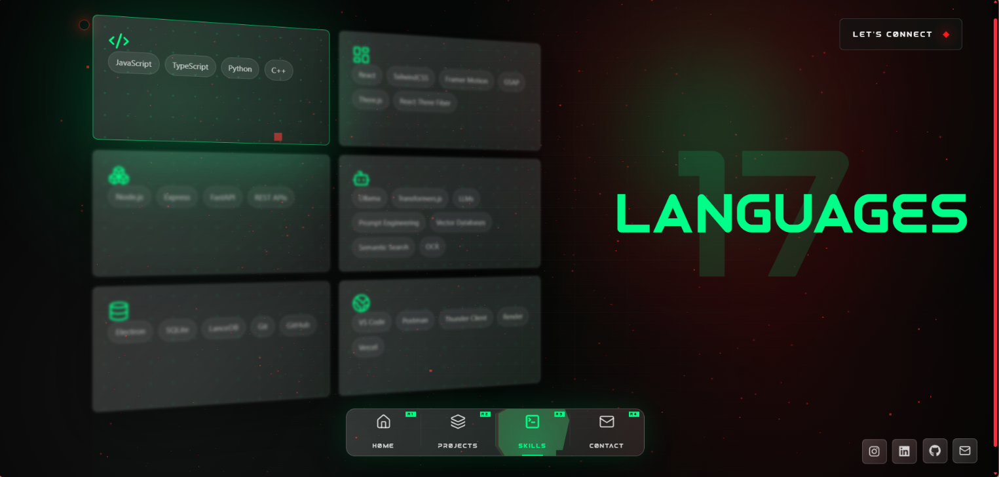
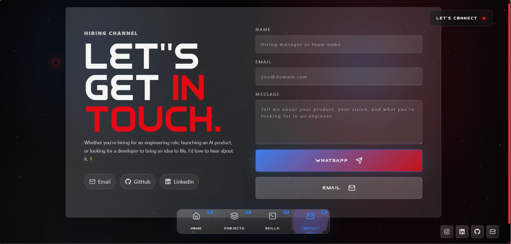

# 👋 Kenny Richardson

# 🚀 AI Engineer • Full-Stack Developer

Building intelligent software, developer tools, desktop applications, and immersive web experiences.

🌐 **Portfolio**
https://kennykrichardson.onrender.com

---

## ✨ About

This repository contains the complete source code for my personal portfolio website.

It showcases:

- 🤖 AI-powered projects
- 💻 Full-stack applications
- 🖥️ Desktop software
- 🎨 UI/UX experiments
- ⚡ Interactive web experiences
- 🚀 Commercial work

---

## 🛠 Tech Stack

### Frontend

- ⚛️ React
- 📘 TypeScript
- ⚡ Vite
- 🎨 Tailwind CSS
- 🎭 Framer Motion

### Graphics

- 🌌 Three.js
- 🎮 React Three Fiber
- ✨ React Three Drei

### Tools

- 🐙 Git
- ☁️ Render

---

## 📂 Featured Projects

### 💰 Quartly

AI-powered finance tracker with modern analytics and budgeting.

---

### 🤖 Orzyn AI

Developer Intelligence Platform for repository analytics and engineering insights.

---

### 🗺 GeoTrail

Interactive travel exploration platform.

---

### 📄 Fluid Deck

AI-powered PowerPoint parser and presentation intelligence.

---

### 📸 FlashFrame

OCR-powered image-to-text extraction application.

---

## Screenshots

### Intro Boot

### Nexus Page

### Projects Page

### Skills Page

### Contact Page

## 📬 Contact

📧 **Email**

kennykrichardson@gmail.com

💼 **LinkedIn**

https://linkedin.com/in/kennyrichardson

🐙 **GitHub**

https://github.com/kennykrichardson

---

## © Copyright

This project is the intellectual property of Kenny Richardson.

All Rights Reserved.

The source code, design, assets, branding, and content may not be copied, redistributed, modified, or used without explicit written permission.

---

### ⭐ Thanks for visiting!

